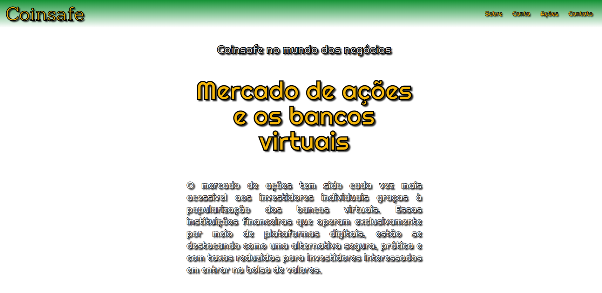

# Coinsafe - Banco Virtual 

Deploy do projeto: https://coiinsafe.netlify.app

### Sobre
É um site de banco virtual o qual inclui, além de conta para realização de pagamentos, também dispõe de especialistas da área de investimentos no mercado de ações, assim como informações e matérias relacionadas.
### Objetivo
Criar um site responsivo com foco em Mobile First e Desktop, incluir um CSS mais focado nessa responsividade entre outras novas ferramentas que ainda não tinha utilizado.
### Desafio
Entender como funciona o Mobile First e suas características foi um desafio a parte. Além de extremamente necessário nos dias atuais devido a tecnologia cada vez mais móvel e rápida, visualmente fica agradável ver que a página é capaz de responder tanto ao tipo de tela pequena de um smartphone como a de um computador. Existem várias variáveis que influenciam o Mobile First, pois assim que se insere um elemento percebi que altera completamente a estrutura do site, portanto é um processo minucioso onde cada detalhe importa e muito. 
### Conclusão
Consegui concluir o meu desafio, aprendi muito com o projeto nesse foco, acredito que vale muito a pena investir nessa habilidade e com toda certeza continuarei me aprofundando no assunto e praticando cada vez mais.
### Ferramentas Utilizadas
- HTML
- CSS
- JavaScript
